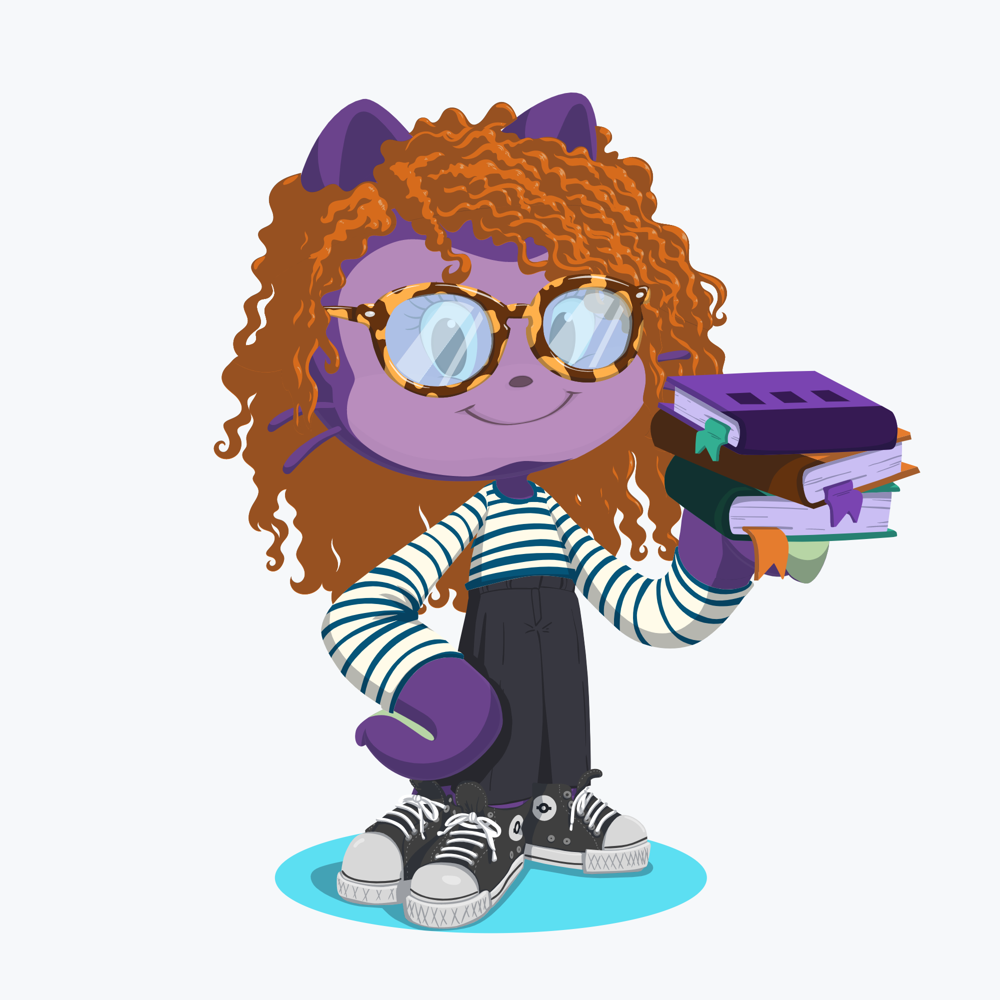

My name is Rachel Novick and I am a web developer located in the Maryland/DC area of the United States. I graduated from Flatiron School in March 2020 after rediscovering a love of code. As a child who lived on the internet, I taught myself very basic web development early on. Being able to pursue something I love as a career is life-changing to me.

 
About Me:
   
   * I know Ruby on Rails, Javascript, React, Redux, but I am always learning more and expanding my knowledge-base (I'm currently teaching myself Angular).
   * I am a bibliophile and always have at least one book on my person at all times.
   * I have a really unique work history that allowed me to hone my skills (both soft and technical) and allow me to communicate effectively.
   * I love learning languages, both speaking and programming. I am out of practice with my Spanish and German, but I am brushing up on them in addition to learning Russian!

   
